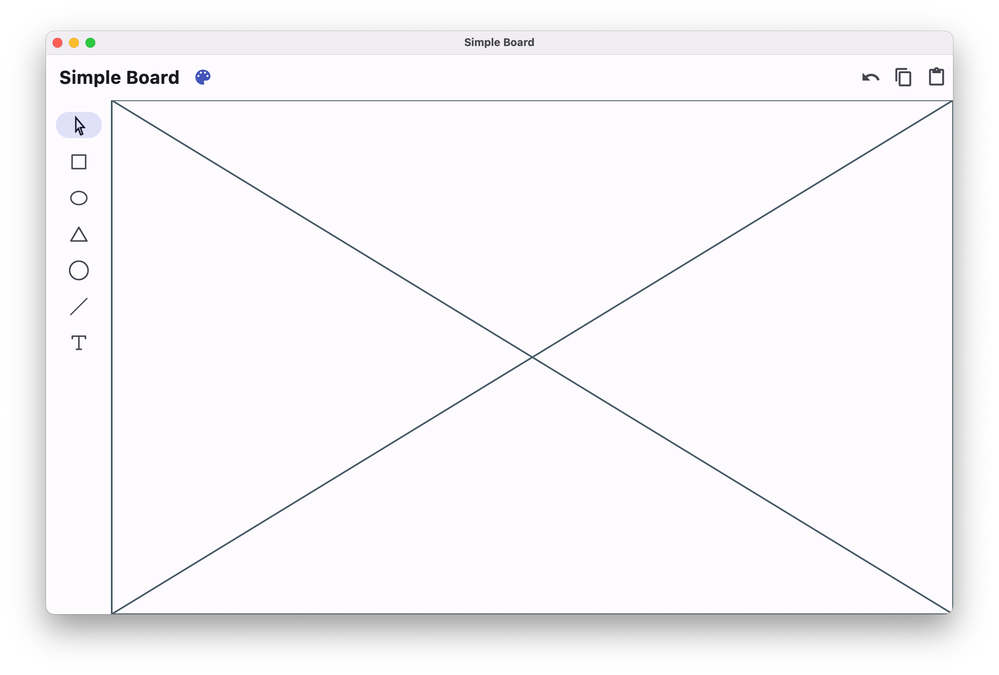
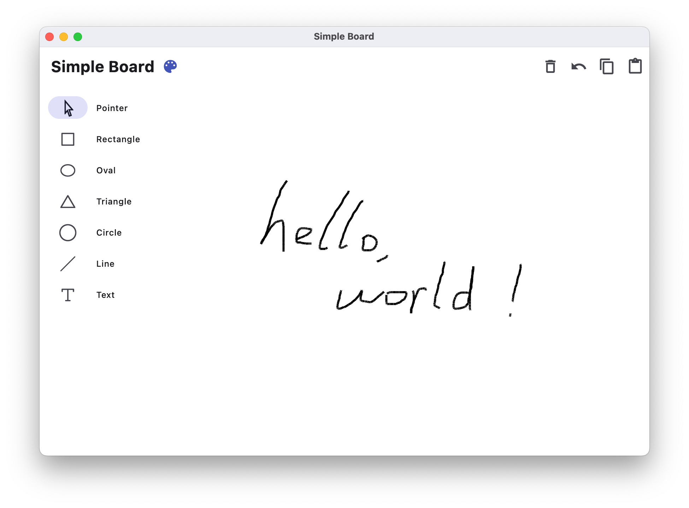
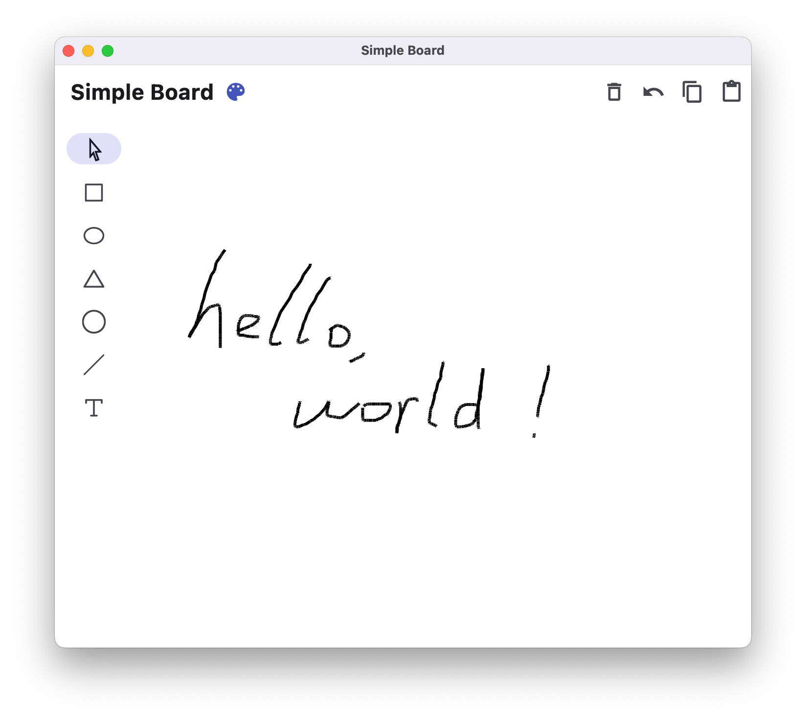
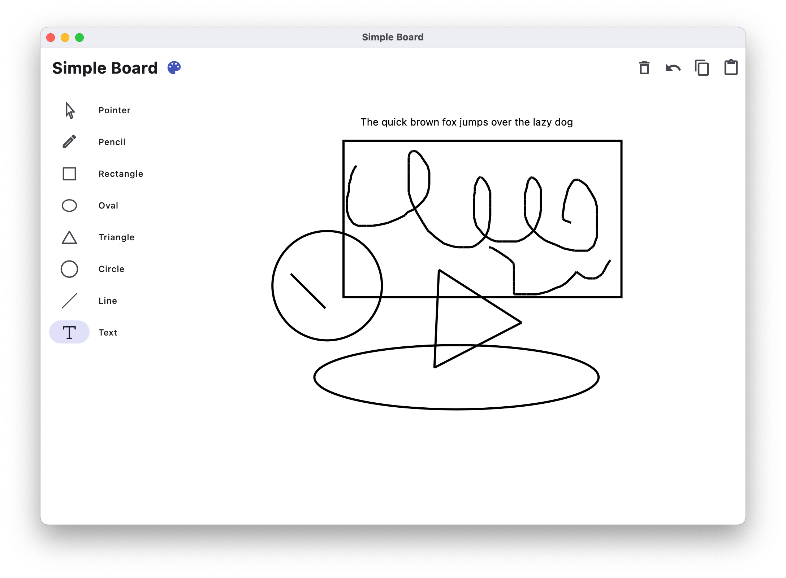
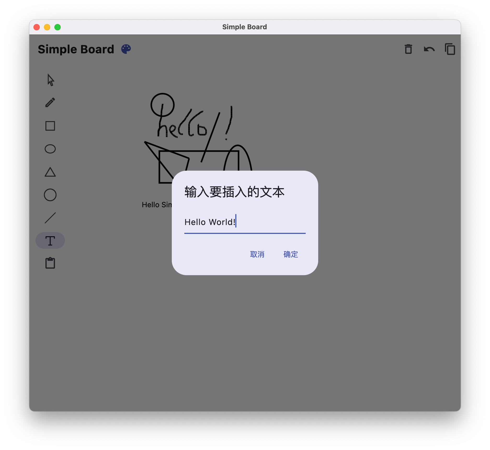
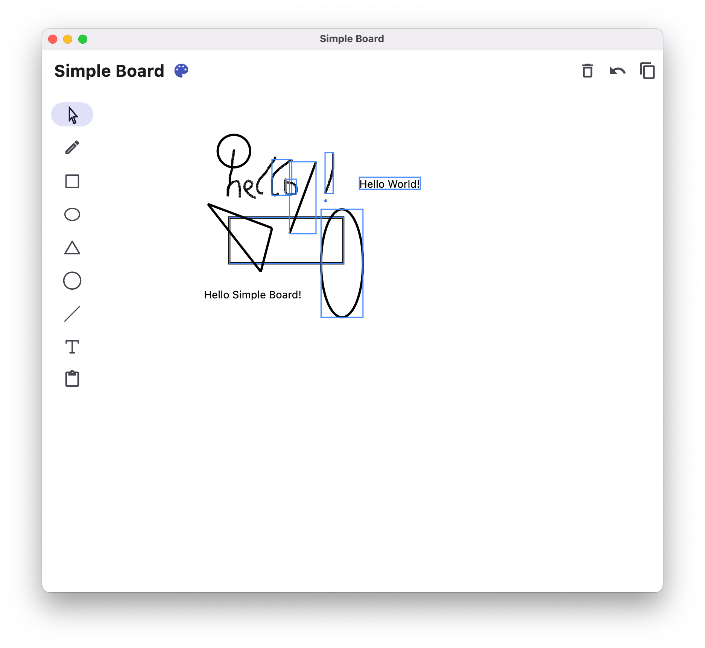
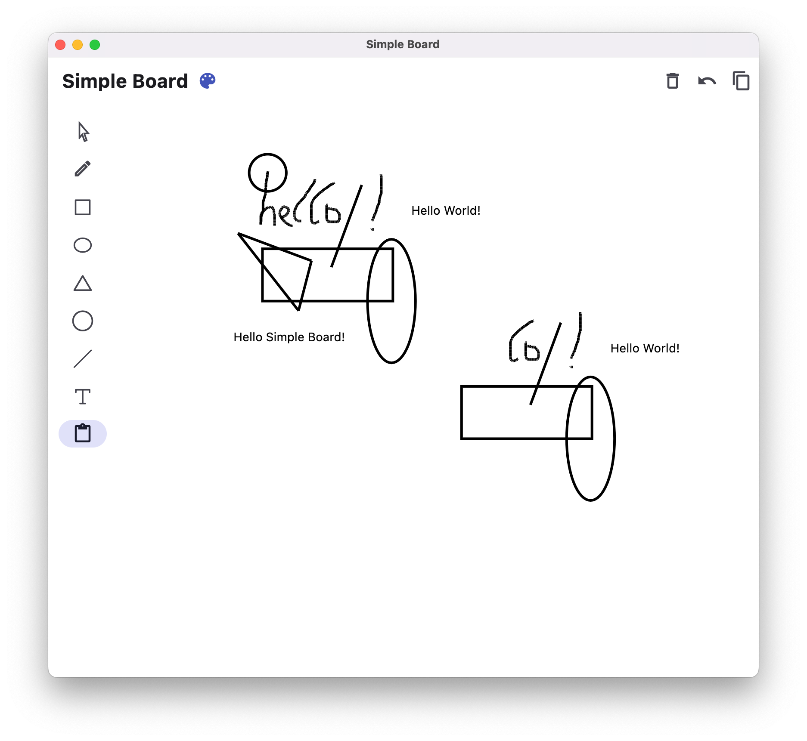
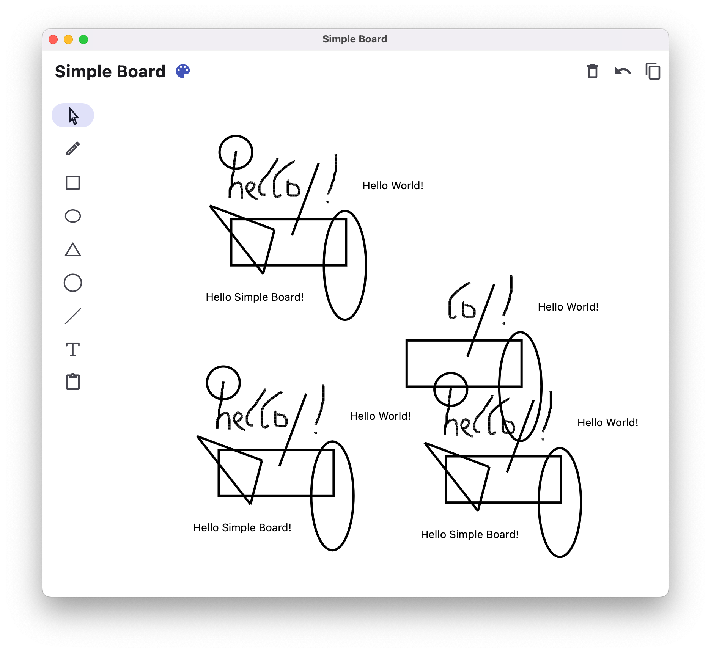

# 开发日志

## 2023.5.14

初步搭建了界面框架，确定了相关功能按钮的位置，下一步将进行画板组件的初步开发

## 2023.5.15

实现了一个*实验性*的画板，微调了界面的配色，加入了*实验性*的画板清空功能，为侧边栏加入了动态调整布局的功能，当应用的宽度足够大时，将会自动展开侧边栏并显示描述

*实验性*：这些功能的逻辑较为简陋，相关代码缺乏可维护性，仅为开发时的临时实验，有可能不会出现在最终产品中

下一步将会继续画板的开发，预计将对目前*实验性*的功能逻辑进行较大修改

## 2023.5.25

重构了之前的实验性功能，并加入了大量新功能，实现了边栏的矩形、椭圆型、三角形、圆形和直线的绘制，加入了撤销上一步操作的功能，并*初步*实现了插入文本（不可修改文本）的功能。目前，软件代码的可扩展性较之前大幅提升，下一步将完全实现文本插入功能，即允许自定义文本插入，此外，未来还将实现图形的选择、复制、粘贴功能。

## 2023.5.26

🥳🥳🥳

实现了预期的功能，在上一个版本的基础上，加入了插入自定义文本的功能，并加入了对图形的选择、复制、粘贴功能。在新版本中，粘贴按钮被从顶部移除，移动到了侧边栏，复制粘贴时，只需使用选择工具选择图形，然后点击复制按钮，随后在侧边栏选择粘贴切换到粘贴状态，在画板上拖动以选择粘贴的位置。

