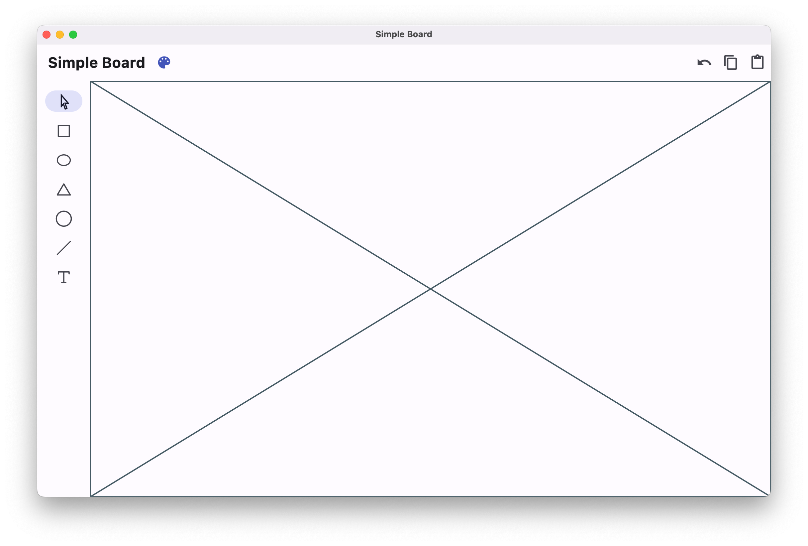
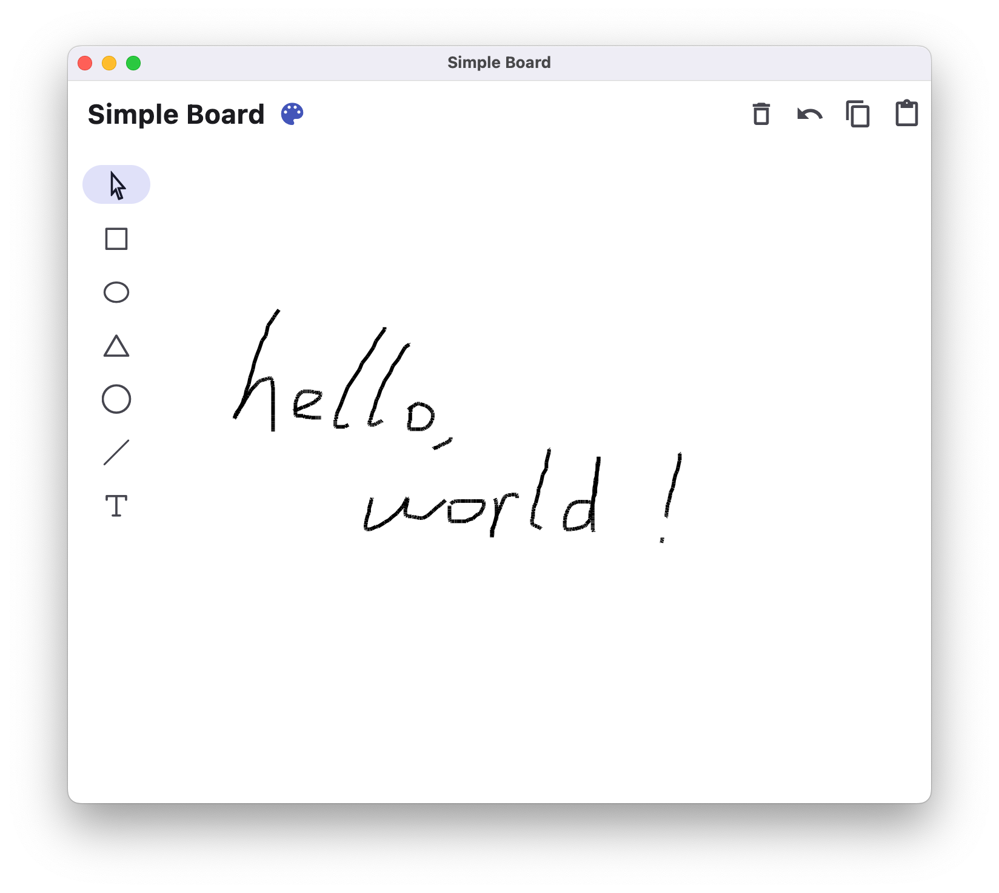
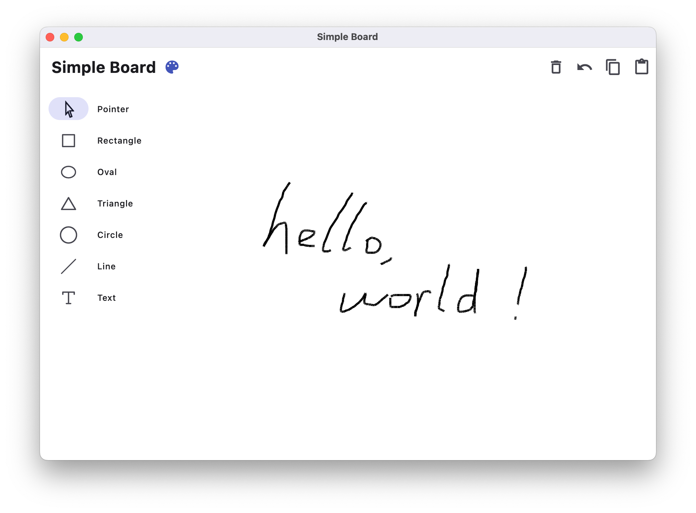

# Simple Board

Simple Board是一款使用Flutter开发的画板程序，拥有矩形、圆形、椭圆型、三角形等多种形状，并提供对绘制图形的复制、粘贴和对操作的撤销功能。

## 开发日志

### 2023.5.14

初步搭建了界面框架，确定了相关功能按钮的位置，下一步将进行画板组件的初步开发

### 2023.5.15

实现了一个*实验性*的画板，微调了界面的配色，加入了*实验性*的画板清空功能，为侧边栏加入了动态调整布局的功能，当应用的宽度足够大时，将会自动展开侧边栏并显示描述

*实验性*：这些功能的逻辑较为简陋，相关代码缺乏可维护性，仅为开发时的临时实验，有可能不会出现在最终产品中

下一步将会继续画板的开发，预计将对目前*实验性*的功能逻辑进行较大修改

