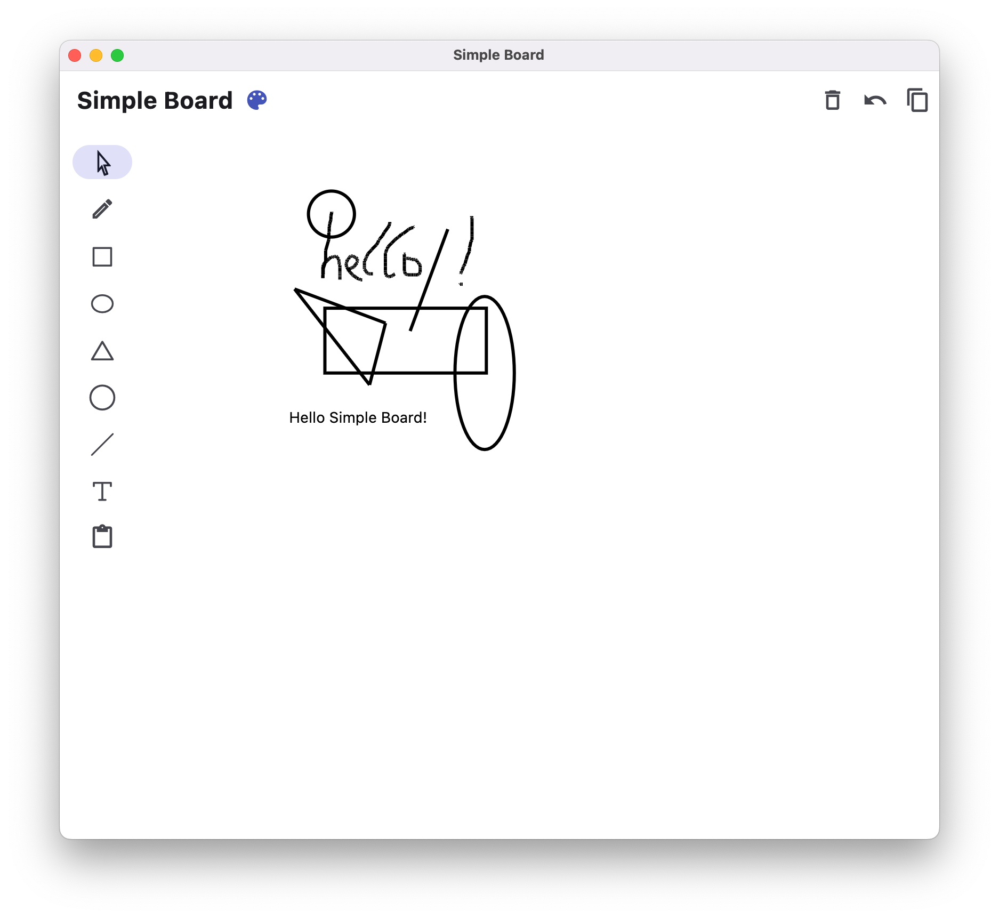
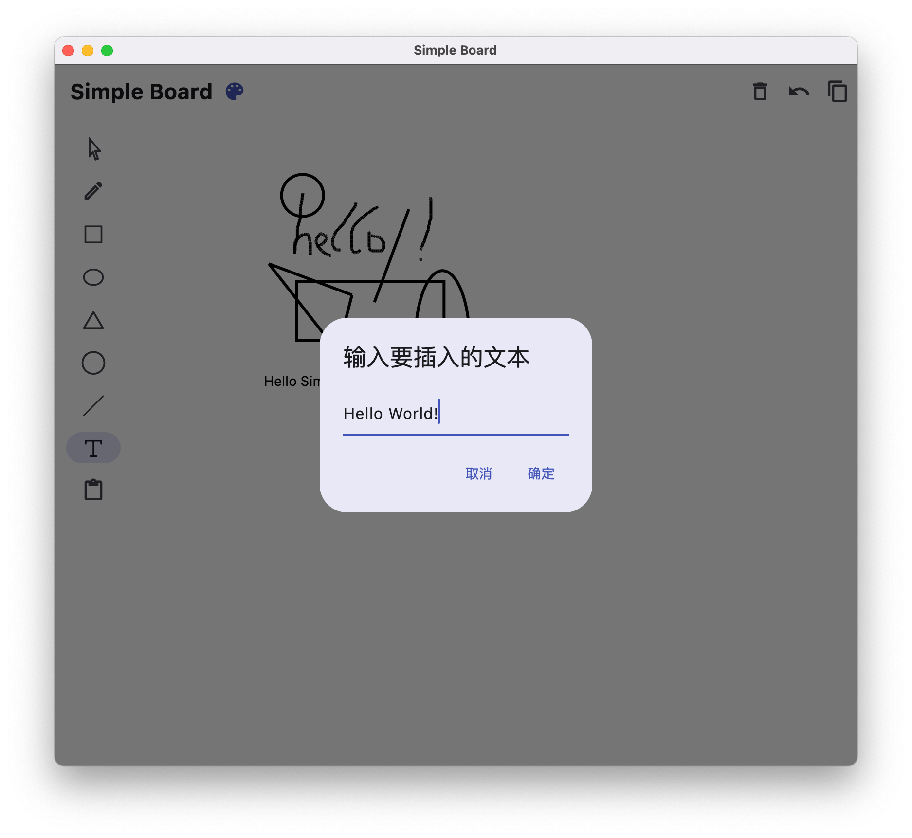
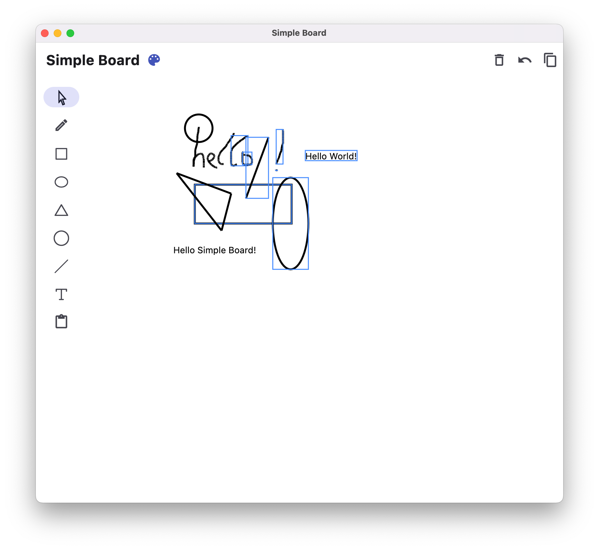
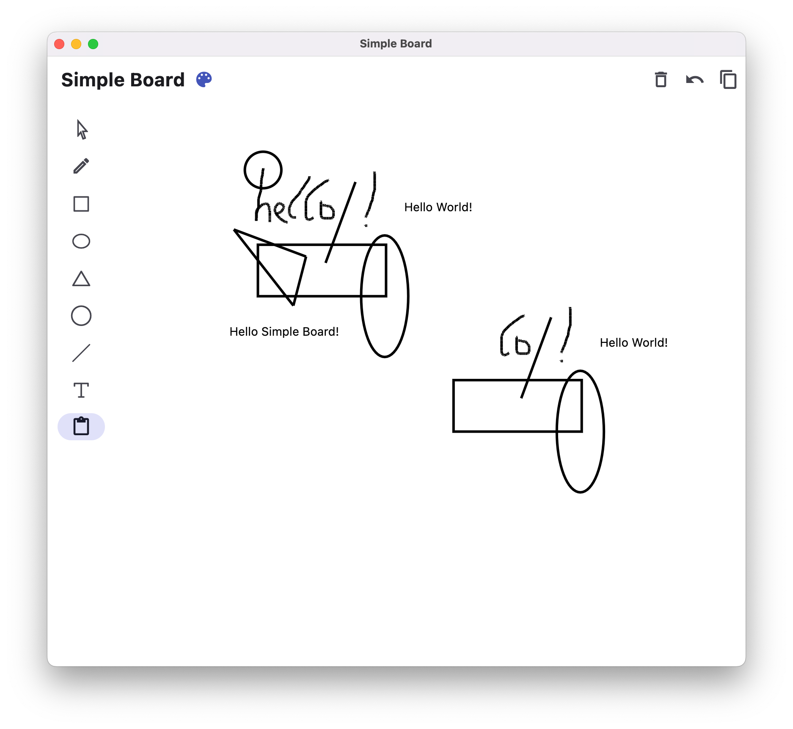

# Simple Board

Simple Board是一款使用Flutter开发的跨平台画板程序，提供对自由线条、矩形、圆形、椭圆、三角形、直线等多种图形的绘制功能，此外，还具有插入文字、复制粘贴图形、撤销操作和清空画板的功能。

可以在 [young-cloud-creator.github.io/Simple-Board](https://young-cloud-creator.github.io/Simple-Board/) 在线体验Web版Simple Board，也可以在 [Releases](https://github.com/young-cloud-creator/Simple-Board/releases/) 页面下载Android或macOS版应用。

## 界面展示

<table><tr>
  <td></td>
  <td></td>
</tr></table>

<table><tr>
  <td></td>
  <td></td>
</tr></table>

## 目录结构

```
.
├── assets // 程序使用到的资源文件
│   └── iconfont.ttf // 程序用到的第三方Icon，包括侧边栏的形状图标等
├── lib // 代码
│   ├── board_component.dart // 画板组件，包括形状、文本等组件类
│   ├── board_tool.dart // 画板组件管理等工具类
│   ├── board_widget.dart // 画板widget类
│   └── main.dart // 主界面相关代码
├── pubspec.lock // 各个直接依赖、间接依赖的包的具体来源和版本号，框架自动生成
├── pubspec.yaml // Dart包的配置文件，用于管理Flutter工程代码的依赖，包括第三方库、Dart运行环境、Flutter SDK等的版本
├── analysis_options.yaml // 代码分析选项配置
│
├── LOG.md // 开发日志
├── README.md // 项目介绍
├── doc // 文档用到的图片等文件
│   └── ...
│
├── android // 框架自动生成的Android代码
│   └── ...
├── ios // 框架自动生成的iOS代码
│   └── ...
├── macos // 框架自动生成的macOS代码
│   └── ...
└── web // 框架自动生成的Web代码
    └── ...
```

## 开发日志

开发历时13天，其中实际开发约4天，开发日志详见 [仓库中的LOG.md文件](LOG.md)
